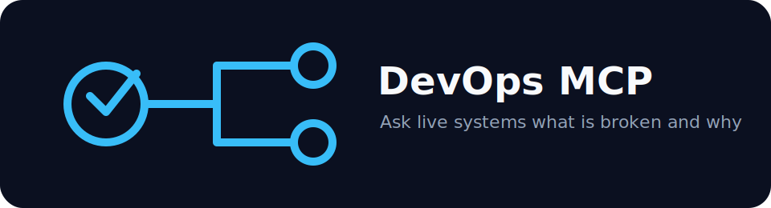

# devops-mcp




> Ask Claude "Why is production down?" and get a real answer from your live systems.

MCP server that connects Claude to your DevOps stack. Query Kubernetes, Jenkins, GitHub Actions, AWS, Azure, GCP, ServiceNow, Slack, and Microsoft Teams in plain English — without switching tabs or terminals.

Built this after watching on-call engineers spend 25 minutes hunting across six dashboards to understand a single incident. It cut our MTTR from 30 minutes to 5 minutes.


## Business impact

LLMs have no visibility into the systems engineers actually use. devops-mcp connects Claude to 7 enterprise systems (Jira, GitHub, Jenkins, AWS, Kubernetes, Grafana, Confluence) in a single MCP server. Deployed internally at Qualcomm to support a globally distributed org. Every hour saved per engineer per week across a 100-person platform team equals ~$1M/year recovered at $200K loaded cost.

---

## What it looks like in practice

```
You: "The API deployment has been stuck for 20 minutes. What's going on?"

Claude:
  [k8s_get_deployment_status("api-server", "production")]
  → desired: 3  ready: 1  updated: 3  strategy: RollingUpdate

  [k8s_get_failing_pods("production")]
  → api-server-7d9f8b-xk2p9  CrashLoopBackOff  restarts: 14
  → api-server-4k8m3-rz9q1   CrashLoopBackOff  restarts: 11

  [k8s_pod_logs("api-server-7d9f8b-xk2p9", tail_lines=30)]
  → [09:10:03] FATAL  postgresql://db-prod:5432: Connection refused

  [k8s_get_events("production", event_type="Warning")]
  → OOMKilling  Pod/db-prod-0  "Memory limit exceeded"  count: 3

  Root cause: db-prod-0 was OOMKilled at 09:09:47. The API pods are
  crash-looping because the database stopped accepting connections.
  INC0045231 is already open and assigned to oncall-sre.
  Fix: raise db-prod memory limit 512Mi → 1Gi.
```

---

## Architecture

> Open `diagrams/architecture.drawio` in [diagrams.net](https://diagrams.net) for the full diagram.

```
+-----------------------------------------------------------------------+
|                           Claude (LLM)                                |
|   "Why is production down?" / "Which jobs are failing right now?"     |
+-----------------------------------+-----------------------------------+
                                    |  MCP Protocol (stdio)
                                    v
+-----------------------------------------------------------------------+
|                          devops-mcp server                            |
|                                                                       |
|  Kubernetes  |  Jenkins/GHA  |  AWS           |  Azure               |
|  pods/events |  build logs   |  CW logs       |  Monitor/AKS         |
|  deployment  |  failing jobs |  metrics/ECS   |  resource health     |
|              |               |                |                      |
|  GCP         |  ServiceNow   |  Slack         |  Teams               |
|  Cloud Logs  |  incidents    |  post/search   |  post/messages       |
|  GKE/Run     |  changes      |  history       |  channels            |
|                                                                       |
|              Audit log  (~/.devops-mcp/audit.log)                    |
+-----------------------------------------------------------------------+
```

---

## Tools

### Kubernetes
| Tool | What it answers |
|---|---|
| `k8s_get_failing_pods` | What pods are crashing right now? |
| `k8s_pod_logs` | What is this pod printing? |
| `k8s_describe_pod` | Full state: conditions, restart counts, events |
| `k8s_get_events` | What Warnings has the cluster emitted? |
| `k8s_get_deployment_status` | Is this rollout progressing or stuck? |

### Jenkins
| Tool | What it answers |
|---|---|
| `jenkins_get_build_status` | Did build #N succeed, and how long did it take? |
| `jenkins_get_build_log` | Last N lines of a build |
| `jenkins_list_failing_jobs` | Which jobs are currently red? |

### GitHub Actions
| Tool | What it answers |
|---|---|
| `gh_get_workflow_run` | Status and conclusion for a specific run |
| `gh_list_failed_runs` | Which workflows have failed in the last 24 hours? |

### AWS
| Tool | What it answers |
|---|---|
| `aws_get_cloudwatch_logs` | What did this log group emit? |
| `aws_get_metric` | Current CloudWatch metric value |
| `aws_describe_s3_bucket` | Versioning, lifecycle, encryption config |
| `aws_get_ecs_service_status` | Running vs desired vs pending |

### Azure
| Tool | What it answers |
|---|---|
| `azure_get_monitor_logs` | KQL query against Log Analytics |
| `azure_get_metric` | Azure Monitor metric |
| `azure_get_aks_node_status` | AKS node pool state |
| `azure_get_resource_health` | Is this Azure resource healthy? |

### GCP
| Tool | What it answers |
|---|---|
| `gcp_get_logs` | Cloud Logging filter query |
| `gcp_get_metric` | Cloud Monitoring metric |
| `gcp_get_gke_cluster_status` | GKE cluster and node pool status |
| `gcp_get_cloud_run_status` | Cloud Run revision and traffic split |

### ServiceNow
| Tool | What it answers |
|---|---|
| `snow_list_incidents` | Open incidents right now |
| `snow_get_incident` | Full detail on INC0012345 |
| `snow_get_change_requests` | Scheduled or in-flight changes |

### Slack / Teams
| Tool | What it does |
|---|---|
| `slack_post_message` | Post to a channel |
| `slack_get_channel_history` | What was said in #incidents recently? |
| `teams_post_message` | Post an alert card via webhook |

---

## Quick start

```bash
git clone https://github.com/gerardrecinto/devops-mcp.git
cd devops-mcp
pip install -e .

# Optional: extras for integrations you use
pip install -e ".[azure]"
pip install -e ".[gcp]"
pip install -e ".[slack]"
```

### Docker

```bash
docker pull ghcr.io/gerardrecinto/devops-mcp:latest
```

```bash
cp .env.example .env
# Fill in credentials. Any service without credentials is skipped.
```

Add to Claude Desktop (`~/Library/Application Support/Claude/claude_desktop_config.json`):

```json
{
  "mcpServers": {
    "devops-mcp": {
      "command": "devops-mcp",
      "env": {
        "KUBECONFIG": "/Users/you/.kube/config",
        "JENKINS_URL": "https://jenkins.example.com",
        "JENKINS_TOKEN": "your-api-token",
        "GITHUB_TOKEN": "ghp_xxxx",
        "AWS_REGION": "us-west-2",
        "SNOW_INSTANCE": "yourcompany.service-now.com",
        "SLACK_BOT_TOKEN": "xoxb-xxxx"
      }
    }
  }
}
```

Restart Claude Desktop. The devops-mcp tools appear in the toolbar.

```bash
# Docker Compose
cp .env.example .env
docker-compose up -d
```

---

## Resilient module loading

Each tool module (Kubernetes, Jenkins, AWS, etc.) loads independently. If a module fails to import — missing credentials, optional dependency not installed — the server logs the error and continues. Every other module still registers its tools normally. Version is logged at startup so it shows in server logs.

This means partial deployments work: install only the extras you need, skip the rest, and the server starts clean every time.

---

## Security

Infrastructure tools are **read-only**. Claude can observe and explain, not modify.

| Action | Available |
|---|---|
| Read pod logs, events, deployment status | yes |
| Read build logs and pipeline status | yes |
| Read CloudWatch / Azure Monitor / Cloud Logging | yes |
| Read ServiceNow incidents and changes | yes |
| Post to Slack / Teams | yes |
| `kubectl apply` / trigger builds / modify resources | no |
| Create or close ServiceNow records | no |

Credentials are environment variables only. Each service is independently optional.
Every tool call is appended to `~/.devops-mcp/audit.log`.

For the commercial path, launch angles, and first-customer profile, see [docs/go-to-market.md](docs/go-to-market.md).

---

## Tests

```bash
pip install -e ".[dev]"
pytest tests/ -v --cov=devops_mcp
```

---

## Roadmap

- [ ] Grafana alert history
- [ ] PagerDuty incident lookup
- [ ] Terraform state drift detection
- [ ] ArgoCD sync status
- [ ] SSE transport

---

## License

MIT
